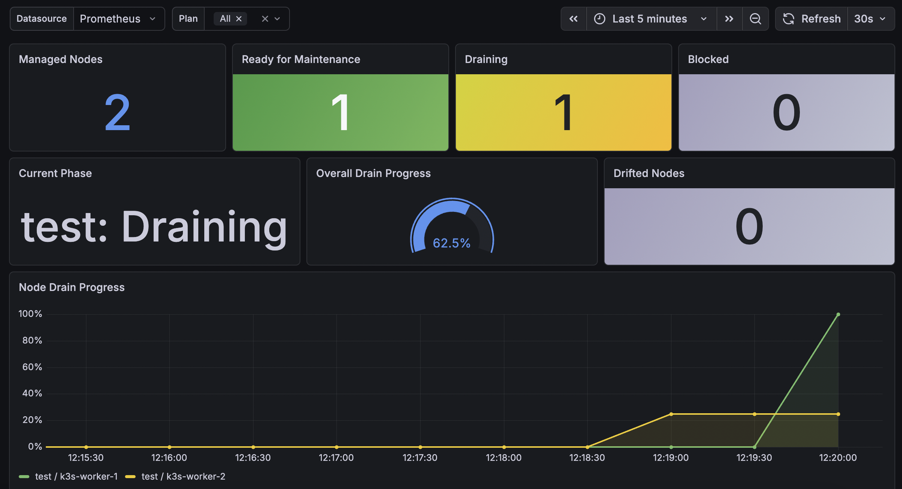

# Node Maintenance Orchestrator

[](https://github.com/Nils-Svensson/node-maintenance-orchestrator/actions/workflows/test.yml)
[](https://github.com/Nils-Svensson/node-maintenance-orchestrator/actions/workflows/test-e2e.yml)
[](https://github.com/Nils-Svensson/node-maintenance-orchestrator/releases/latest)
[](go.mod)
[](LICENSE)
[](https://artifacthub.io/packages/helm/node-maintenance-orchestrator/node-maintenance-orchestrator)

A Kubernetes operator for orchestrating node maintenance.

## Overview

Most Kubernetes infrastructure workflows are now declarative and GitOps-managed, but node maintenance still often relies on imperative `kubectl drain` commands or ad-hoc scripts.

`node-maintenance-orchestrator` introduces a declarative `NodeMaintenancePlan` resource for coordinating node maintenance. Plans can be reviewed, versioned, scheduled, and audited through Git like the rest of the cluster.

The operator provides:

- automated node cordon and drain orchestration
- PodDisruptionBudget-aware eviction handling
- scheduled maintenance windows with configurable drain concurrency
- pre-drain preview — dry-run analysis of evictions before maintenance begins
- drain timeout enforcement
- per-node progress reporting and conflict detection between plans
- snapshot-based node selection for label selectors
- cooperative drift handling

---

## Example

```yaml
apiVersion: maintenance.nmoo.io/v1alpha1
kind: NodeMaintenancePlan
metadata:
  name: demo
spec:
  reason: "Planned maintenance"

  nodes:
    - kind-worker3
    - kind-worker4
    - kind-worker5

  cordon:
    enabled: true
    startAt: "2026-05-24T12:00:00Z"

  drain:
    enabled: true
    startAt: "2026-05-24T12:30:00Z"
    timeoutMinutes: 60

    options:
      maxParallel: 2
      deleteEmptyDirData: true
      force: false
      podTerminationGracePeriodSeconds: 60
      respectPodDisruptionBudgets: false
      ignoreDaemonSets: true
```

All drain options, `startAt`, and `timeoutMinutes` are optional.

A minimal plan behaves similarly to:

```bash
kubectl drain --ignore-daemonsets
```

with orchestration, retries, scheduling, and status tracking layered on top.

---

## Status visibility

```bash
kubectl get nmp demo
```

```text
NAME   PHASE     READY   PROGRESS   DRAINING   BLOCKED   DRIFT   AGE
demo   Draining   1/3     67%        2/3        0/3      false   47s
```

The operator reports:

- maintenance progress
- draining nodes
- blocked nodes
- drift detection
- readiness for maintenance

---

## Metrics

The operator exposes a Prometheus-compatible metrics endpoint on port 8443 (HTTPS). A Grafana dashboard is provided at [`grafana/nmo-dashboard.json`](grafana/nmo-dashboard.json).



The dashboard shows plan phase, overall drain progress, per-node progress over time, blocked nodes, evicted pod counts, and drift detection.

To scrape metrics with the Prometheus Operator, enable the ServiceMonitor:

```yaml
metrics:
  serviceMonitor:
    enabled: true
    additionalLabels:
      release: prometheus  # match your Prometheus instance selector
```

For kubectl-based installs the ServiceMonitor is included in the default manifests. If the Prometheus Operator is not installed, the ServiceMonitor can be safely ignored — it has no effect without a running Prometheus Operator.

---

## Requirements

- Kubernetes 1.27+ (tested against 1.35.1; likely works on 1.27 and later)
- Helm 3 (for Helm-based installation)

---

## Installation

### Helm

```bash
helm install nmo oci://ghcr.io/nils-svensson/charts/node-maintenance-orchestrator \
  --version <version> \
  --namespace nmo-system \
  --create-namespace
```

### kubectl

```bash
kubectl apply -f https://github.com/Nils-Svensson/node-maintenance-orchestrator/releases/download/<version>/install.yaml
```

---

## Uninstall

### Helm

```bash
helm uninstall nmo --namespace nmo-system
kubectl delete namespace nmo-system
```

### kubectl

```bash
kubectl delete -f https://github.com/Nils-Svensson/node-maintenance-orchestrator/releases/download/<version>/install.yaml
```

---

## Documentation

- [Architecture](docs/architecture.md)
- [API reference](docs/api-reference.md)
- [Drift handling](docs/drift-handling.md)
- [Maintenance lifecycle](docs/maintenance-lifecycle.md)
- [Events and conditions](docs/events-and-conditions.md)

---

## Project status

Alpha / experimental.

APIs and behavior may change before v1beta1.

---

## What's next

- **nodeSelector drift recovery** — re-adopt a drifted node without requiring the plan to be deleted and recreated
- **Richer preview** — depending on feasibility and complexity
- **Enforcement policy** — an `enforcementPolicy` option letting users choose between the current cooperative mode and an authoritative mode that actively re-enforces the desired cordon state against external changes

---

## Non-goals

- **Node provisioning or deprovisioning** — the operator does not create, delete, or replace nodes. It only coordinates workload eviction on existing nodes.
- **OS upgrades or patching** — the operator prepares nodes for maintenance (cordon + drain) but does not perform the maintenance itself. What happens after `readyForMaintenance=true` is outside its scope.
- **Cluster upgrade orchestration** — for full cluster upgrade workflows, consider dedicated tools. This operator handles individual node preparation as one step in that process.
- **Cloud-provider maintenance integration** — the operator does not integrate with cloud-specific node lifecycle events such as AWS Spot interruptions, GKE node auto-upgrades, or Azure scheduled maintenance notifications. It operates at the Kubernetes API level only.

---

## Contributing

Issues and pull requests are welcome.

Please open an issue before starting significant work so we can discuss the approach.

---

## License

Licensed under the Apache License, Version 2.0.